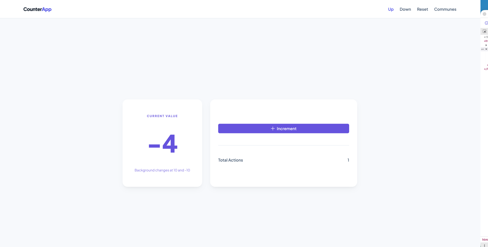
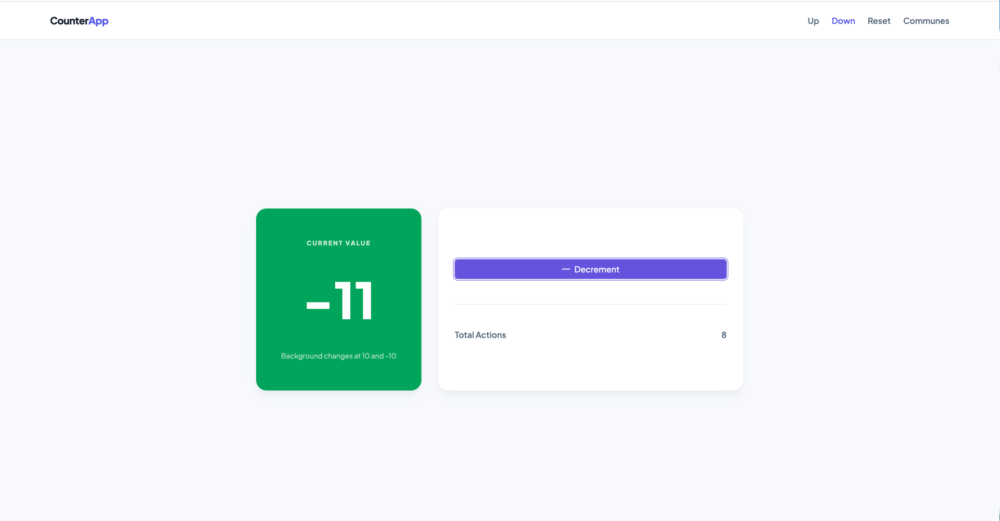
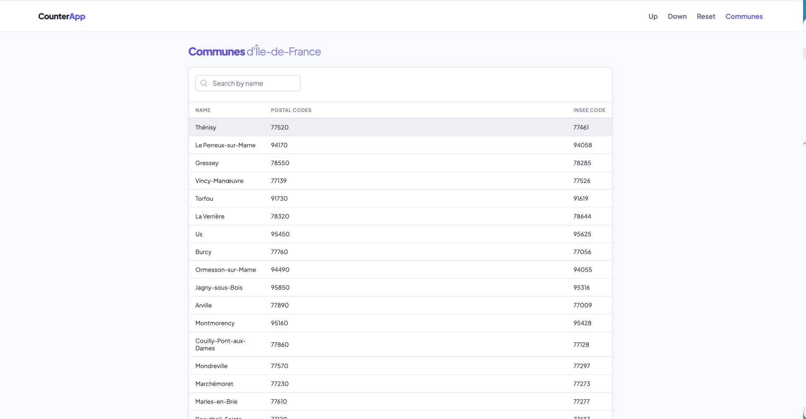
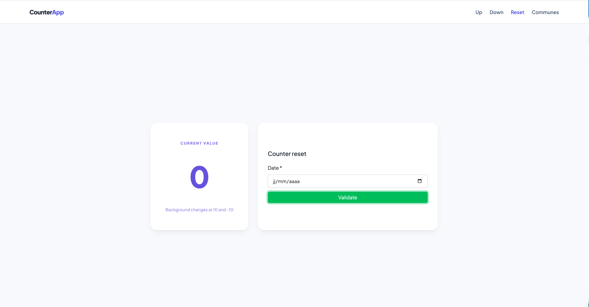

# CounterApp 

---

## À propos du projet
Ce projet est constitué d'une application Angular pour le frontend et de FastApi pour le backend. 
Il implémente un compteur persistant avec un système de routes, une synchronisation  des communes d'Île de france avec l'API Adresse du gouvernement.
La synchronisation des communes est faite toute les 5min via le backend avec celery
### Fonctionnalités

- **Compteur persistant** visible sur toutes les pages, conservé au rafraîchissement
- **Routes `/up` et `/down`** pour incrémenter/décrémenter le compteur de X
- **Multiplicateur dynamique** : X double tous les 30 clics (X = 1, puis 2, 4, 8…)
- **Changement de fond** : rouge (`#e74c3c`) à 10, vert (`#27ae60`) à -10
- **Route `/reset`** avec sélecteur de date et bouton de validation
- **Synchronisation API** : récupération des communes d'Île-de-France toutes les 5 minutes via l'API `adresse.data.gouv.fr`, stockées en base
- **Reset automatique** : si le compteur atteint le code postal de Melun, il revient à 0
- **Navigation** entre toutes les pages via une barre de navigation
---

## Captures d'écran

### Pages Compteur Up & Down 





### Page — Communes d'Île-de-France



### Page Reset



---

## Stack technique

|             |                             |
|-------------------|-----------------------------|
| Frontend          | Angular 21, PrimeNG         |
| Backend           | FastAPI, SQLAlchemy         | 
| Tâches planifiées | Celery, Redis               | 
| Base de données   | MariaDB, Redis avec Docker  |
| Style             | SCSS, design tokens PrimeNG |

---

## Choix techniques et architecture

### Angular — Signals & Standalone Components

J'ai choisi les **signals** pour gérer l'état du compteur plutôt que RxJS pour ce cas simple.  Cela garantit sa persistance entre les routes sans complexité mais d'être avec l'orientation d'angular en matière de programation réactive.

Les composants sont tous **standalone**.

J'ai aussi implémenté un intercepteur Http pour la gestion de certains types d'erreurs

### Persistance du compteur

Le compteur survit au rafraîchissement via **localStorage**. Le `CounterService` hydrate ses signaux au démarrage et écrit à chaque mutation.

### Backend — FastAPI

J'ai implémenté un **middleware** qui catch toutes les exceptions avec affichage de la stack strace en fonction de l'environnement.

### Synchronisation des communes

La récupération des communes d'Île-de-France est une **tâche Celery planifiée** toutes les 5 minutes via Celery Beat. Elle appelle `https://adresse.data.gouv.fr` et persiste les résultats en base de donnée.

L'UI Angular propose aussi une possibilité d'effectué une recherche via la pages liste de communes

### Reset via code postal de Melun

Le frontend consomme l'endpoint backend qui expose les communes. Si la valeur du compteur atteint le code postal de Melun (récupéré dynamiquement depuis la base), le compteur est automatiquement remis à 0.

### Theming PrimeNG

J'ai défini un **preset PrimeNG custom** basé sur les couleurs Papernest (bleu `#6c5ce7`, vert `#2ed8a3`) avec des design tokens pour m'alligner sur les couleurs de marque. Le thème est appliqué globalement via `providePrimeNG()` dans `app.config.ts`.

---

## Prérequis

- Python 3.10+
- Node.js 22+
- Docker 20.10+
---

## Installation & Lancement


### 1. Clonner le projet

```bash
git clone https://github.com/mgbetegan/counter-app.git
```

### 2. Base de donnée

```bash
cd backend
cp .env.db.example .env.db
# Editer .env.db avec vos paramètres de db
docker compose -f docker-compose-db.yml up -d
```


### 3. Backend

```bash
cd backend

python -m venv .venv
source .venv/bin/activate   # Linux/Mac
.venv\Scripts\activate      # Windows

pip install -r requirements.txt

cp .env.example .env
# Éditer .env avec vos paramètres de connexion

#Appliquer les migrations pour la création des tables en base de donnée
alembic upgrade head

# Lancer l'API
python -m start
```


### 4. Celery (Pour la récupération des communes d'Île de france toute les 5min)

```bash
# Dans une nouveau terminal naviguez à nouveau dans bakcend
cd backend

python -m celery -A tasks.worker_app.celery_app worker --beat --loglevel=info

```

### 5. Frontend

```bash
# Depuis la racine du projet,
cd frontend

npm install
ng serve
```

L'application est disponible sur http://localhost:4200

---
